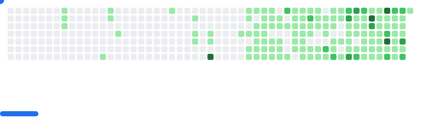

<!-- github-breakout
Generate a Breakout game SVG from a GitHub user's contributions graph.
https://github.com/cyprieng/github-breakout
-->
<picture>
  <source
    media="(prefers-color-scheme: dark)"
    srcset="images/breakout-dark.svg"
  />
  <source
    media="(prefers-color-scheme: light)"
    srcset="images/breakout-light.svg"
  />
  
</picture>
